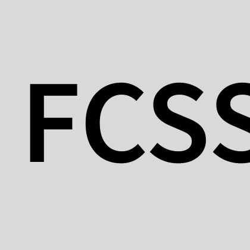

# ForgeCSS

ForgeCSS turns strings into fully generated responsive CSS using a custom DSL.

How and why + documentation here http://forgecss.krasimirtsonev.com

## Getting started

ForgeCSS is distributed as an **npm** package. So:

```bash
npm install forgecss
```

Create a configuration file named `forgecss.config.json` in the root of your project:

```json
{
  "dir": "./src",
  "output": "./public/styles.css",
  "breakpoints": {
    "mobile": "480px",
    "tablet": "768px",
    "desktop": "1024px"
  }
}
```

Now, you can use the ForgeCSS CLI to compile your CSS:

```bash
npx forgecss
```

or

```bash
npx forgecss -w
```

if you want to run ForgeCSS in watch mode.

This command will read your source files:

- It will find the `.css/.less/.scss` files and build an inventory of utility classes.
- It will then parse your `.html/.jsx/.tsx` files to find the utility class usages.
- Finally, it will generate a compiled CSS file at the specified output path (`./public/styles.css` in this case).

One last thing – since ForgeCSS is not touching your source files you have to use the `fx` (ForgeCSS expression) helper function:

```jsx
import fx from 'forgecss/fx';

function MyComponent() {
  return (
    <div className={fx("p2 mobile:p1")}>
      Hello, ForgeCSS!
    </div>
  );
}
```

This is so you get the proper class name strings transformed. For example, `p2 mobile:p1` becomes  
`p2 mobile_p1`.

If you don't use React there is an `fx` function that you can use in the browser:

```html
<script src="http://unpkg.com/forgecss@latest/dist/client.min.js"></script>
```

Once you include that file on your page you'll get the `class` attributes converted automatically.  
If you later want to trigger that logic manually you can execute the globally available function `fxAll`.  
Internally it calls `fx`, which is also available globally for manual usage.
